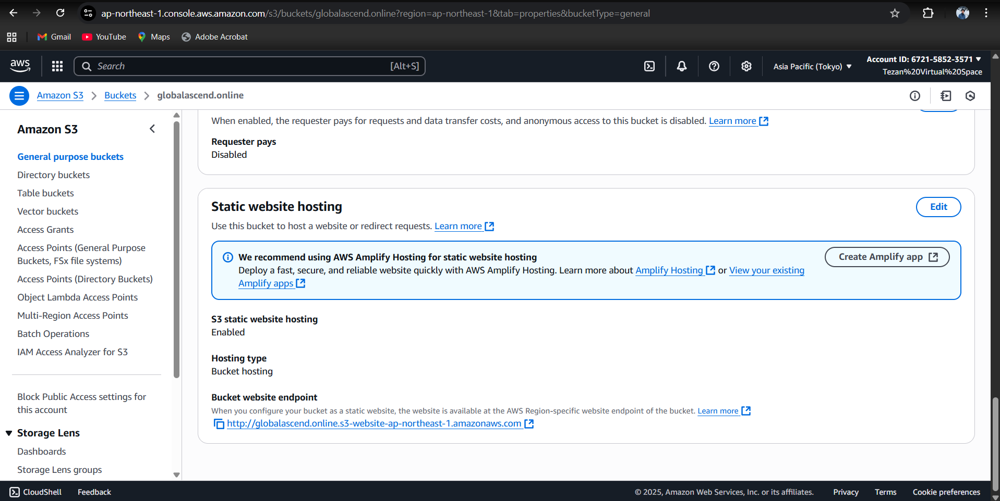

# 🚀 Scalable Static Website with S3 + Cloudflare + GitHub Actions

  
  
  
  

---

## 📑 Table of Contents

- [Architecture Overview](#-architecture-overview)
- [Objective](#-objective)
- [Tools & Technologies Used](#-tools--technologies-used)
- [Project Prerequisites](#-project-prerequisites)
- [Repository Structure](#-repository-structure)
- [Step-by-Step Setup Guide](#-step-by-step-setup-guide)
- [GitHub Actions Workflow Explained](#-github-actions-workflow-explained)
- [Cloudflare Configuration](#-cloudflare-configuration)
- [Deliverables](#-deliverables)
- [Screenshots + Report](#-screenshots--report)
- [Future Improvements](#-future-improvements)
- [Conclusion](#-conclusion)
- [Author & License](#-author--license)

---

## 🏗 Architecture Overview

Developer (GitHub Push)
|
v
GitHub Actions CI/CD -----> AWS S3 Bucket (Static Website Hosting)
| |
| v
|------------------> Cloudflare CDN + SSL
|
v
🌍 https://globalascend.online

---

## 🎯 Objective

Host and auto-deploy a **static website** using **AWS S3 (Free Tier)**, served globally with **Cloudflare CDN + HTTPS**, and auto-trigger deployments using **GitHub Actions**.

---

## 🛠 Tools & Technologies Used

- **AWS S3 (Free Tier)** → Website hosting
- **Cloudflare (Free)** → CDN, SSL, caching, custom domain
- **GitHub Actions** → CI/CD automation
- **HTML/CSS/JS** → Static site design
- **Bash** → Deployment scripting

---

## 📋 Project Prerequisites

- AWS account (Free Tier enabled)
- Cloudflare account (Free)
- GitHub account with repository setup
- Domain name (e.g., `globalascend.online`)
- Installed tools: Git, VS Code, AWS CLI

---

## 📂 Repository Structure

static-website-s3/
│
├── .github/workflows/
│ └── deploy.yml # GitHub Actions workflow
├── index.html # Landing page
├── style.css # Website styling
├── script.js # Optional interactivity
├── README.md # Documentation (this file)
├── LICENSE # License file
└── docs/ # Documentation & Screenshots
├── deployment-report.md
└── screenshots/
├── aws_s3_console.png
├── cloudflare_dashboard.png
├── cloudflare_ssl_tls.png
├── github_actions.png
└── live_site.png

---

## ⚙️ Step-by-Step Setup Guide

### 1. Static Website in GitHub

- Create repo `static-website-s3`
- Add `index.html`, `style.css`, `script.js`
- Push to GitHub

### 2. AWS S3 Setup

- Create bucket: `globalascend.online` (region: **ap-northeast-1**)
- Enable **Static Website Hosting**
- Set **bucket policy = public-read**

### 3. GitHub Actions CI/CD

- Add `deploy.yml` in `.github/workflows/`
- On **push → Sync files → Deploy to S3**

### 4. Cloudflare Integration

- Add domain → Point **NameServers** to Cloudflare
- Proxy traffic → S3 static website
- Enable SSL (**Always Use HTTPS**)

### 5. Cache & Optimization

- Cache Rule:
  - **If URL Path = `*` → Cache Everything**
  - **Edge TTL = 1 hour**

---

## 🤖 GitHub Actions Workflow Explained

`deploy.yml`:

- **Trigger** → On push to `main` branch
- **Job** → Checkout repo → Configure AWS credentials → Sync to S3
- **Output** → Website updated automatically 🎉

---

## 🌐 Cloudflare Configuration

- **SSL/TLS** → Flexible/Full (enabled HTTPS)
- **Rules** → Redirect `www.globalascend.online` → `https://globalascend.online`
- **Caching Rule** → Cache Everything

---

## 📦 Deliverables

✅ GitHub Actions CI/CD workflow file  
✅ Cloudflare + S3 integration steps  
✅ Live website: [https://globalascend.online](https://globalascend.online)  
✅ Documentation (this README)  
✅ Deployment report with screenshots

---

## 📸 Screenshots

### 1) Live Website

### 2) AWS S3 Console

### 3) GitHub Actions (Successful Run)

### 4) Cloudflare Dashboard

### 5) Cloudflare SSL/TLS

---

## 🧾 Deployment Report

📄 [docs/deployment-report.md](docs/deployment-report.md)

---

## 🚀 Future Improvements

- Add **custom 404 page**
- Add **responsive animations** (3D effects, scroll reveal)
- Enable **Cloudflare Workers** for API routes
- **Multi-region hosting** (S3 replication)

---

## 🏁 Conclusion

This project demonstrates a **scalable, automated, and cost-free static site hosting architecture** using **AWS S3, Cloudflare, and GitHub Actions**. It provides:

- Zero-downtime deployments
- Global CDN performance
- Automatic HTTPS
- Professional DevOps workflow

---

## 👨‍💻 Author & License

**Author:** Tezan Tyagi  
📧 Email: tezantyagi3461@gmail.com  
📞 Phone: +91-817469371  
🌐 Website: [https://globalascend.online](https://globalascend.online)

**License:** MIT License
