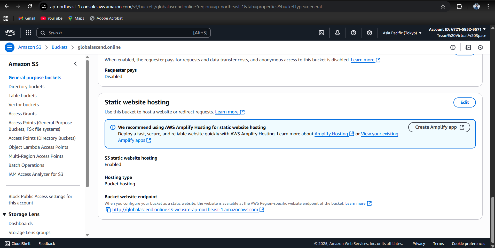
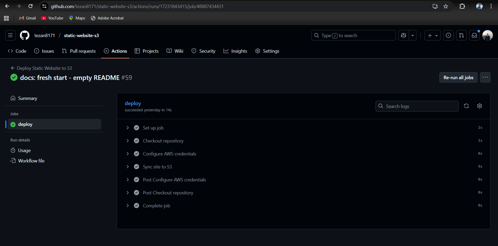
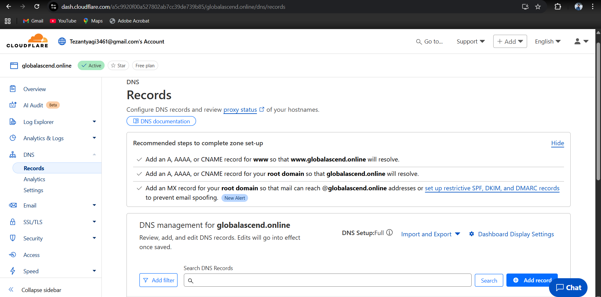
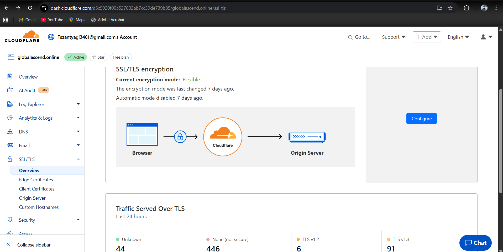

# 📄 Deployment Report: Scalable Static Website with S3 + Cloudflare + GitHub Actions

---

## 📌 Project Overview

This deployment project demonstrates how to host a **static website** using **AWS S3**, integrate it with **Cloudflare** for CDN + SSL, and automate deployments with **GitHub Actions**.

---

## 🎯 Objectives

- Deploy a static website on **AWS S3 (Free Tier)**
- Enable **HTTPS & CDN caching** via **Cloudflare**
- Implement **CI/CD automation** with **GitHub Actions**
- Provide **step-by-step documentation** and screenshots

---

## 🛠 Tools & Services Used

- **AWS S3** → Static Website Hosting
- **Cloudflare** → CDN, SSL/TLS, caching, DNS management
- **GitHub Actions** → CI/CD pipeline
- **Domain** → [globalascend.online](https://globalascend.online)
- **Tech Stack** → HTML, CSS, JS

---

## ⚙️ Deployment Steps

### 1️⃣ Repository Setup

- Created GitHub repository → `static-website-s3`
- Added base files: `index.html`, `style.css`, `script.js`, `deploy.yml`
- Configured `.gitignore` and `LICENSE`

---

### 2️⃣ AWS S3 Setup

- Created S3 bucket: `globalascend.online` (region: **ap-northeast-1**)
- Enabled **Static Website Hosting**
- Configured **bucket policy = public-read**
- Uploaded initial website files

📸 Screenshot:  

---

### 3️⃣ GitHub Actions CI/CD

- Added `deploy.yml` workflow under `.github/workflows/`
- Configured **AWS credentials** via GitHub Secrets
- Workflow: On push → Sync repo → Deploy to S3

📸 Screenshot:  

---

### 4️⃣ Cloudflare Integration

- Added domain `globalascend.online` to Cloudflare
- Updated **NameServers** at registrar to Cloudflare’s NS
- Enabled **SSL/TLS → Full mode** (Always Use HTTPS)
- Configured caching rules: **Cache Everything, Edge TTL = 1 hour**

📸 Screenshot:  
  

---

### 5️⃣ Website Verification

- Successfully deployed → [https://globalascend.online](https://globalascend.online)
- Verified **HTTPS + CDN** performance
- Tested **CI/CD auto-deployment**

📸 Screenshot:  

---

## ✅ Deliverables

- [x] Static website hosted on AWS S3
- [x] CI/CD workflow with GitHub Actions
- [x] Cloudflare integration (CDN + SSL + caching)
- [x] Documentation with screenshots
- [x] Live website: [https://globalascend.online](https://globalascend.online)

---

## 🚀 Future Enhancements

- Add **custom 404 page**
- Enable **Cloudflare Workers** for serverless functions
- Configure **multi-region hosting** (S3 replication)
- Add **CI/CD notifications** (Slack/Email)

---

## 🏁 Conclusion

This deployment validates the power of combining **AWS S3**, **Cloudflare**, and **GitHub Actions** for building a **scalable, automated, and cost-free static site hosting solution**.  
It ensures **global performance, automated updates, and HTTPS security** — aligning with modern DevOps practices.

---

## 👨‍💻 Author

**Tezan Tyagi**  
📧 Email: tezantyagi3461@gmail.com  
📞 Phone: +91-817469371  
🌐 Website: [https://globalascend.online](https://globalascend.online)

---
